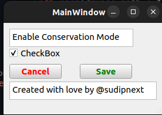

# Lenovo Energy Management Unofficial (Linux)

This is an unofficial Lenovo Energy Management tool for Linux, created out of the necessity for such a tool on the platform.a


## Tested Models

| Model Name | Conservation Mode | Rapid Charge Mode | User-Friendly Interface | Tested |
| --- | --- | --- | --- | --- |
| Lenovo Ideapad Gaming 3 Ryzen 5 5600H | ✅ | 🔄 | ✅ | ✅ |

## Symbols in the Table

- ✅: The feature is currently working.
- 🔄: The feature is planned for future releases.
- ❌: The feature is not available for the specific model.

## Getting Started

These instructions will get you a copy of the project up and running on your local machine.

### Prerequisites

Ensure you have `git` installed on your machine to clone the repository.

### Installation

1. **Clone the repository**

    Open a terminal and run the following git command:
    ```bash
    git clone https://github.com/sudipnext/lenovo_energy_management.git
    ```

2. **Navigate to the application directory**

    Change your current directory to the project's `dist` folder:
    ```bash
    cd lenovo_energy_management/dist
    ```

3. **Grant execution permissions**

    You need to give execution permissions to the application:
    ```bash
    chmod +x conservation
    ```

4. **Run the application**

    Now, you can run the application:
    ```bash
    ./conservation
    ```

## Author

- [@sudipnext](https://github.com/sudipnext) - Initial work

Built with ❤️ for Linux users.